# 3.1. Planificación del Proyecto en Jira

## Descripción general

La planificación del proyecto OptiAcademic se realizó utilizando la metodología ágil Scrum mediante Jira Software. Esta herramienta permitió organizar el trabajo en épicas, historias de usuario, sprints, versiones y métricas ágiles, manteniendo trazabilidad entre la planificación, los entregables y la complejidad del problema.

El proyecto aborda la generación automática de horarios académicos, considerando restricciones asociadas a docentes, cursos, aulas, matrícula y disponibilidad horaria. Debido a esta complejidad, el trabajo fue estructurado de forma incremental, priorizando primero las funcionalidades base y posteriormente los módulos de generación, validación, detección de conflictos y exportación de horarios.

---

# a. Artefactos requeridos

---

## 1. Backlog del producto

El Product Backlog fue organizado en Jira mediante historias de usuario priorizadas según valor de negocio, riesgo técnico y complejidad de implementación. Cada historia representa una funcionalidad necesaria para el desarrollo del sistema OptiAcademic.

Las historias fueron estimadas utilizando puntos de historia, lo que permitió medir el esfuerzo relativo de cada actividad y distribuirlas adecuadamente en los sprints.

### Evidencia

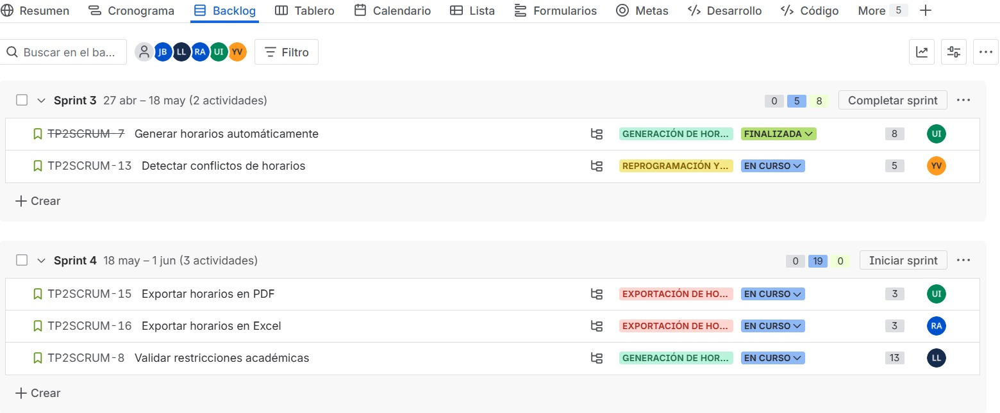

---

## i. Historias de usuario correctamente formuladas

Las historias de usuario fueron redactadas bajo el formato ágil:

> Como [actor], quiero [funcionalidad], para [beneficio].

Este formato permite identificar claramente quién utiliza la funcionalidad, qué necesita realizar y cuál es el valor que aporta al sistema.

### Ejemplo de historia de usuario

**Historia:** Generar horarios automáticamente.

**Descripción:**  
Como administrador, quiero generar horarios automáticamente, para reducir el tiempo de planificación manual.

Esta historia representa una funcionalidad crítica del sistema, ya que se relaciona directamente con el objetivo principal del proyecto: automatizar la planificación académica y reducir errores en la asignación de horarios.

### Subtareas asociadas

Dentro de Jira, esta historia fue descompuesta en subtareas técnicas, tales como:

- Diseñar modelo CSP.
- Implementar algoritmo base en el backend.
- Integrar datos de docentes, aulas y cursos.
- Generar horarios iniciales.
- Realizar pruebas de generación.

Esta descomposición facilita el seguimiento del avance y permite distribuir responsabilidades dentro del equipo.

### Evidencia

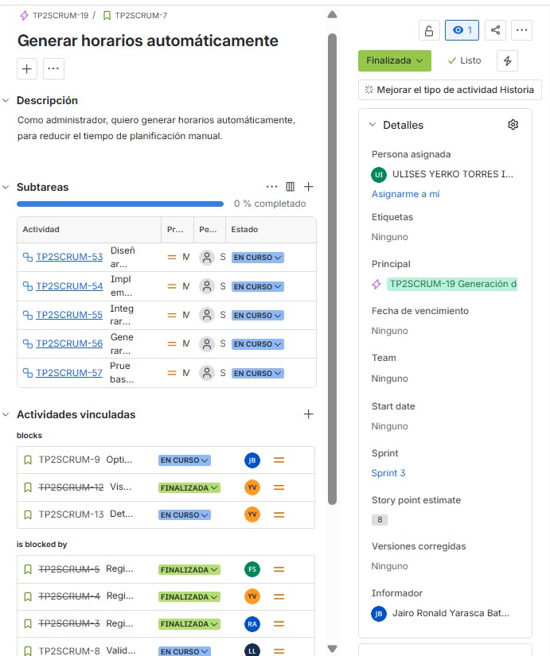

---

## ii. Priorización basada en valor, riesgo y complejidad

La priorización del backlog se realizó considerando tres criterios principales:

| Criterio | Descripción |
|---|---|
| Valor | Nivel de aporte funcional al sistema y beneficio para el usuario |
| Riesgo | Posibilidad de fallos o impacto negativo si la funcionalidad no se implementa correctamente |
| Complejidad | Nivel de esfuerzo técnico requerido para implementar la historia |

Las funcionalidades relacionadas con la generación automática de horarios, validación de restricciones y detección de conflictos fueron priorizadas debido a que representan el núcleo del sistema.

Por ejemplo, la historia **“Generar horarios automáticamente”** fue asignada con una estimación de **8 puntos de historia**, ya que requiere integración de datos, procesamiento lógico y validación de restricciones. Asimismo, actividades como **“Validar restricciones académicas”** y **“Detectar conflictos de horarios”** presentan mayor complejidad por su relación directa con la consistencia del horario generado.

---

## iii. Relación con restricciones del problema CSP

El problema de generación de horarios académicos se relaciona con un modelo de satisfacción de restricciones, debido a que el sistema debe producir horarios válidos respetando múltiples condiciones al mismo tiempo.

Las historias del backlog se vinculan con restricciones como:

- Un docente no puede dictar dos clases al mismo tiempo.
- Un aula no puede ser asignada a más de un curso en la misma franja horaria.
- Los cursos deben respetar la disponibilidad docente.
- Los horarios deben evitar cruces entre asignaturas.
- La capacidad del aula debe ser coherente con la demanda de estudiantes.
- La generación de horarios debe considerar cursos, aulas, docentes y matrícula.

En Jira, esta relación se evidencia en historias como:

- Generar horarios automáticamente.
- Detectar conflictos de horarios.
- Validar restricciones académicas.
- Optimizar horarios generados.

Estas historias permiten conectar la planificación ágil con el problema técnico central del proyecto.

---

# 2. Estructuración del trabajo

La estructuración del trabajo se realizó mediante épicas, versiones y sprints. Esta organización permitió dividir el desarrollo en bloques funcionales y facilitar el control del avance del equipo.

---

## i. Épicas alineadas a funcionalidades críticas

Las épicas fueron definidas en función de los módulos principales del sistema. Cada épica agrupa historias de usuario relacionadas con una funcionalidad crítica del proyecto.

| Épica | Funcionalidad asociada |
|---|---|
| Autenticación y usuarios | Gestión de acceso, usuarios y roles |
| Gestión académica | Registro de cursos, docentes, aulas y datos base |
| Generación de horarios | Creación automática de horarios académicos |
| Visualización de horarios | Consulta y presentación de horarios |
| Reprogramación y conflictos | Validación, detección y resolución de conflictos |
| Exportación de horarios | Generación de reportes en PDF y Excel |

Esta división permite abordar el sistema de manera modular, evitando que todas las funcionalidades se desarrollen de forma desordenada.

### Evidencia

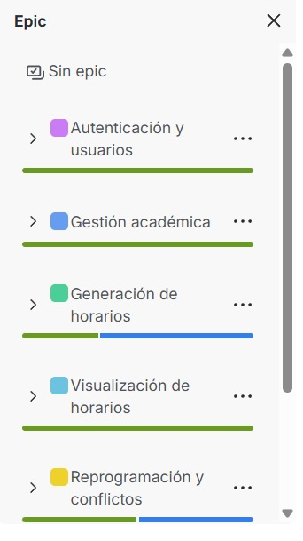

---

## ii. Versiones coherentes con entregables

Las versiones fueron configuradas para representar entregas incrementales del sistema. Cada versión agrupa un conjunto de funcionalidades que deben estar listas en una fecha determinada.

| Versión | Objetivo | Fecha de inicio | Fecha de publicación |
|---|---|---|---|
| v1.0 MVP | Sistema básico de generación de horarios académicos | 16 de abril de 2026 | 30 de abril de 2026 |
| v1.1 | Optimización, exportación y detección de conflictos | 1 de mayo de 2026 | 30 de junio de 2026 |

La versión **v1.0 MVP** representa el producto mínimo viable, centrado en contar con una base funcional del sistema. La versión **v1.1** amplía el alcance incorporando optimización, exportación de horarios y detección de conflictos.

### Evidencia

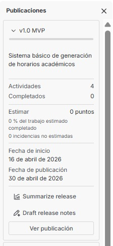

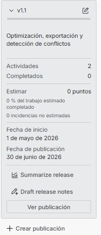

---

## iii. Sprints definidos con objetivos claros

El trabajo fue distribuido en sprints, cada uno con un objetivo funcional específico. Esta organización permite desarrollar el sistema de forma progresiva y controlar el avance mediante iteraciones.

| Sprint | Periodo | Objetivo |
|---|---|---|
| Sprint 1 | 16 de marzo – 6 de abril de 2026 | Inicio del proyecto, análisis y funcionalidades base |
| Sprint 2 | 6 de abril – 27 de abril de 2026 | Gestión académica y preparación de datos |
| Sprint 3 | 27 de abril – 18 de mayo de 2026 | Generación de horarios y detección de conflictos |
| Sprint 4 | 18 de mayo – 1 de junio de 2026 | Exportación de horarios y validación de restricciones |

En el Sprint 3 se observa la historia **“Generar horarios automáticamente”**, marcada como finalizada, y la historia **“Detectar conflictos de horarios”**, en curso. En el Sprint 4 se incluyen actividades como exportar horarios en PDF, exportar horarios en Excel y validar restricciones académicas.

### Evidencia

---

# 3. Gestión temporal

---

## i. Cronograma del proyecto

El cronograma del proyecto fue representado mediante una línea de tiempo tipo Gantt, organizada desde marzo hasta junio de 2026. Esta planificación permite visualizar la distribución temporal de las actividades principales.

| Mes | Actividades principales |
|---|---|
| Marzo | Inicio del proyecto y análisis de requerimientos |
| Abril | Diseño del sistema y modelado CSP |
| Mayo | Desarrollo backend y frontend |
| Junio | Integración, pruebas, evaluación final y entrega |

El cronograma muestra una secuencia lógica de trabajo, iniciando con el análisis y diseño, continuando con el desarrollo de los módulos principales y finalizando con integración, pruebas y entrega del producto.

### Evidencia

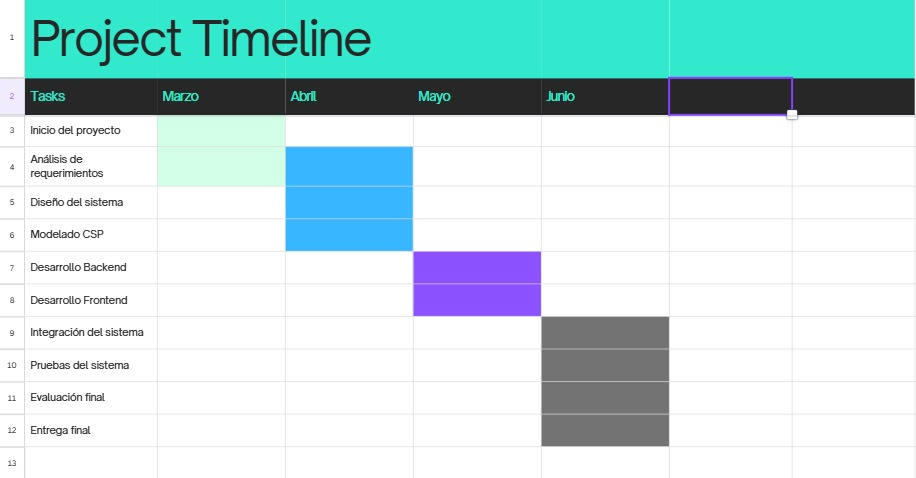

---

## ii. Identificación de dependencias y ruta crítica

En Jira se definieron dependencias entre historias para representar la secuencia lógica del desarrollo. Estas dependencias permiten identificar qué tareas deben completarse antes de iniciar otras.

### Dependencias principales

| Actividad | Depende de |
|---|---|
| Generar horarios automáticamente | Registrar docentes, registrar cursos, registrar aulas y validar restricciones |
| Detectar conflictos de horarios | Generar horarios automáticamente |
| Optimizar horarios generados | Generar horarios automáticamente |
| Visualizar horarios | Generar horarios automáticamente |
| Exportar horarios en PDF y Excel | Visualizar horarios y contar con horarios generados |

### Ruta crítica identificada

La ruta crítica del proyecto es:

> Inicio del proyecto → Análisis de requerimientos → Diseño del sistema → Modelado CSP → Registro de datos académicos → Generación de horarios → Validación de restricciones → Detección de conflictos → Integración del sistema → Pruebas → Entrega final.

Esta ruta representa las actividades que no deben retrasarse, ya que impactan directamente en la entrega del sistema.

### Evidencia

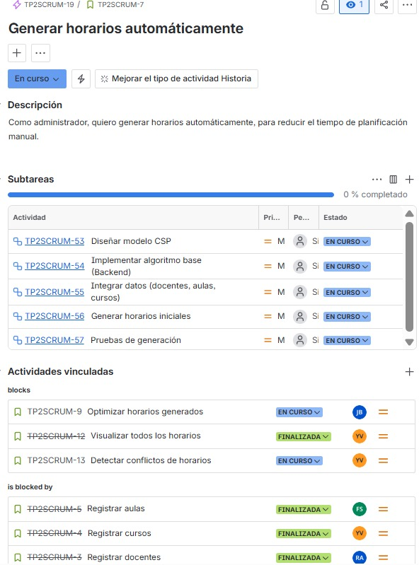

---

# 4. Métricas ágiles

Las métricas ágiles fueron obtenidas desde los reportes de Jira Software. Estas permiten analizar el avance del equipo, el trabajo completado, el trabajo pendiente y la velocidad durante los sprints.

---

## i. Gráfico de trabajo hecho (Burnup)

El gráfico Burnup permite visualizar el trabajo completado respecto al alcance total del sprint.

En el Sprint 1 se observa que el trabajo completado alcanza aproximadamente 20 puntos de historia. Esto indica que el equipo logró cerrar una cantidad significativa de trabajo al finalizar el sprint.

En el Sprint 2 se observa un avance de aproximadamente 15 puntos de historia completados, lo que muestra continuidad en el desarrollo, aunque con una carga ligeramente menor respecto al Sprint 1.

### Interpretación

El Burnup evidencia que el equipo logró completar trabajo en ambos sprints, aunque el alcance y la cantidad de puntos variaron. Esta diferencia puede estar asociada a la complejidad técnica de las historias y a la incorporación de actividades relacionadas con la generación automática de horarios.

### Evidencia

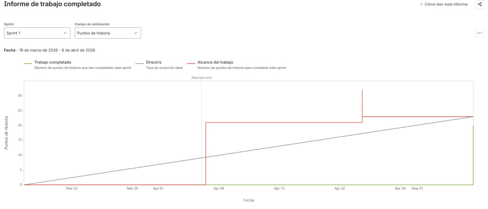

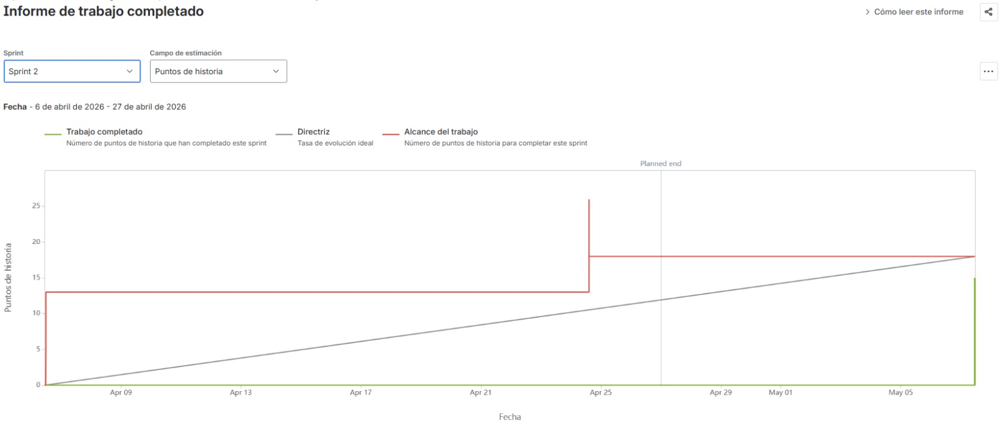

---

## ii. Gráfico de trabajo pendiente (Burndown)

El gráfico Burndown permite monitorear la cantidad de trabajo restante durante el sprint.

En el Sprint 1 se observa una reducción del trabajo pendiente hacia el cierre del sprint, aunque con variaciones durante el periodo. Esto indica que algunas tareas fueron agregadas o ajustadas durante la ejecución.

En el Sprint 2 también se observa una disminución del trabajo restante al cierre del sprint. Sin embargo, el gráfico evidencia que durante el sprint existieron ajustes en el alcance, lo cual es común en proyectos ágiles cuando se refinan historias o se agregan subtareas.

### Interpretación

El Burndown muestra que el equipo logró reducir el trabajo pendiente, pero también evidencia variaciones en el alcance. Esto puede interpretarse como un ajuste normal dentro del proceso Scrum, especialmente debido a la complejidad técnica del modelo de horarios y sus restricciones.

### Evidencia

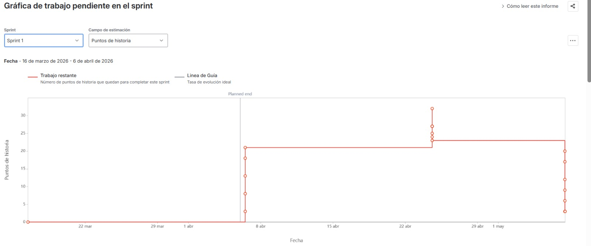

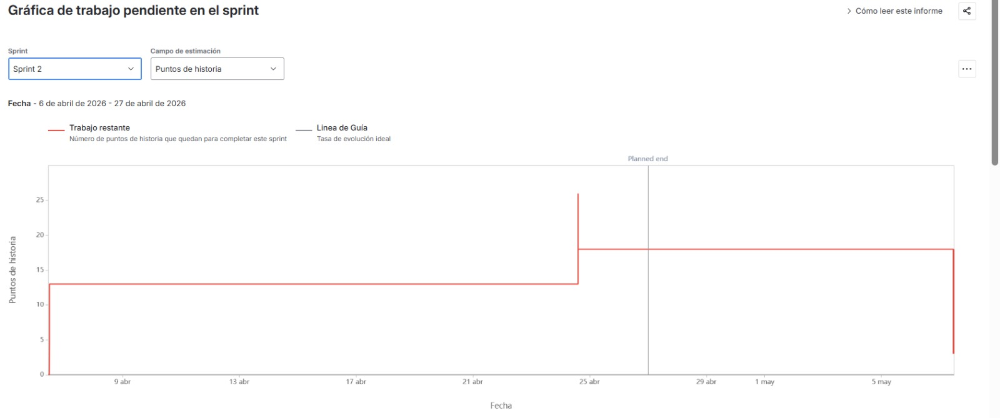

---

## iii. Gráfico de velocidad

El gráfico de velocidad permite medir la capacidad del equipo en función de los puntos de historia completados por sprint.

Según el reporte, el equipo completó aproximadamente:

| Sprint | Puntos completados |
|---|---|
| Sprint 1 | 20 puntos |
| Sprint 2 | 15 puntos |

El promedio mostrado es aproximadamente **17.5 puntos de historia**.

### Interpretación

La velocidad del equipo presenta una variación moderada entre el Sprint 1 y el Sprint 2. Esta diferencia puede explicarse por la complejidad distinta de las historias desarrolladas. Mientras algunas tareas iniciales fueron más directas, las historias relacionadas con generación de horarios y validación de restricciones implicaron mayor dificultad técnica.

A pesar de esta variación, el equipo mantiene una capacidad de avance estable, lo cual permite estimar futuros sprints con mayor precisión.

### Evidencia

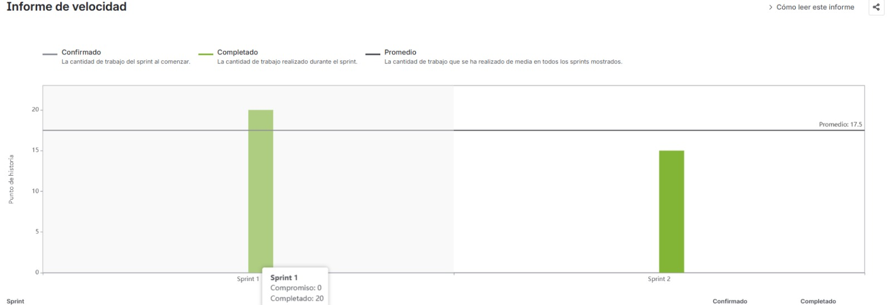

---

## iv. Gráfico de control

El gráfico de control permite analizar el tiempo promedio requerido para completar actividades dentro del flujo de trabajo. Esta métrica ayuda a identificar demoras, tareas bloqueadas o actividades que permanecen demasiado tiempo en un mismo estado.

En el proyecto, el gráfico de control permite evaluar el comportamiento del flujo Scrum, especialmente en tareas asociadas a generación de horarios, validación de restricciones y detección de conflictos.

### Interpretación

El análisis del gráfico de control permite detectar posibles variaciones en el tiempo de resolución de tareas. Las actividades de mayor duración se relacionan principalmente con componentes técnicos complejos, como el modelado CSP, la validación de restricciones y la detección de conflictos.

> Nota: Si se incorpora una captura del gráfico de control de Jira, debe guardarse en la ruta `./img/control_chart.jpeg` y agregarse como evidencia en esta sección.

<!--  -->

---

# b. Análisis esperado

---

## 1. Interpretación de la evolución del proyecto

La evolución del proyecto muestra un avance incremental coherente con Scrum. Inicialmente se trabajaron actividades base como análisis, diseño y configuración académica. Posteriormente, el equipo avanzó hacia funcionalidades más complejas, como generación automática de horarios, detección de conflictos, validación de restricciones y exportación.

La planificación permitió construir el sistema de forma progresiva, asegurando que las funcionalidades críticas se desarrollen sobre una base previamente definida.

---

## 2. Identificación de cuellos de botella

Los principales cuellos de botella identificados fueron:

- Modelado CSP.
- Implementación del algoritmo de generación de horarios.
- Validación de restricciones académicas.
- Detección de conflictos de horarios.
- Integración de datos de docentes, aulas, cursos y matrícula.

Estas actividades presentan mayor complejidad porque requieren procesar múltiples restricciones al mismo tiempo. Además, cualquier error en estas funcionalidades afecta directamente la calidad del horario generado.

---

## 3. Evaluación de la estabilidad del equipo

La estabilidad del equipo se evaluó mediante la velocidad registrada en los sprints. El Sprint 1 completó aproximadamente 20 puntos de historia, mientras que el Sprint 2 completó aproximadamente 15 puntos. Esto genera una velocidad promedio de 17.5 puntos.

La variación entre ambos sprints es moderada y puede considerarse aceptable, debido a que las tareas no tuvieron el mismo nivel de dificultad. Las historias relacionadas con el núcleo del sistema, como generación automática y validación de restricciones, demandaron mayor esfuerzo técnico.

En general, el equipo mantuvo una tendencia de avance estable y logró completar funcionalidades importantes dentro del periodo planificado.

---

## 4. Coherencia entre planificación y complejidad del problema

La planificación realizada es coherente con la complejidad del problema porque el trabajo fue dividido en módulos funcionales mediante épicas, historias de usuario y sprints.

Además, las funcionalidades más críticas fueron priorizadas y ubicadas en sprints específicos. Esto permitió abordar primero la base del sistema y luego avanzar hacia componentes más complejos como generación de horarios, validación de restricciones y detección de conflictos.

La planificación también se apoya en métricas ágiles como Burnup, Burndown y Velocity Chart, lo cual permite monitorear el avance del proyecto y realizar ajustes durante el desarrollo.

En conclusión, la organización en Jira evidencia una planificación estructurada, trazable y coherente con la complejidad técnica del sistema OptiAcademic.
